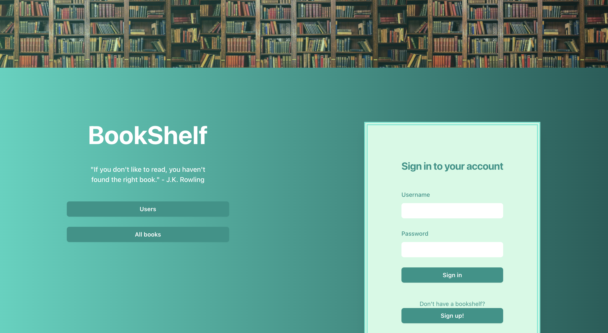

<section id="two" class="spotlights">
	<section>
		

			

				<header class="major">
					<h3>BookShelf</h3>
					<h5><a href="https://book-app-vdho.onrender.com/">https://book-app-vdho.onrender.com/</a></h5>
					<i></i>
				</header>
				
BookShelf is a web application designed for book enthusiasts to manage their reading lists, view and interact with other users and their book collections, and share their reading experiences through comments and ratings.

			

		

	</section>
</section>
 
<section id="two" class="spotlights">
	<section>
		

			

				<header class="major">
					<h3>Blogs</h3>
					<i></i>
				</header>
				
This is the backend for a blog application built using Node.js, Express, PostgreSQL with Sequelize for ORM, Umzug for migrations, and JSON Web Token (JWT) for authentication. The backend provides API endpoints to manage users, blogs, and user interactions like logging in/out and maintaining reading lists.

			

		

	</section>
</section>
 
<section id="two" class="spotlights">
	<section>
		

			

				<header class="major">
					<h3>Flight diary</h3>
					<i></i>
				</header>
				
Simple frontend project using TypeScript. Users can fetch and create diary entries for a personal fligth diary.

			

		

	</section>
</section>

