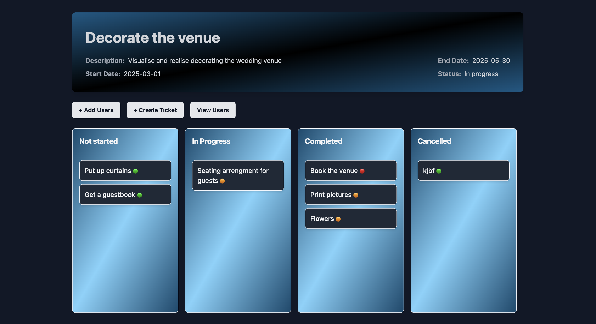
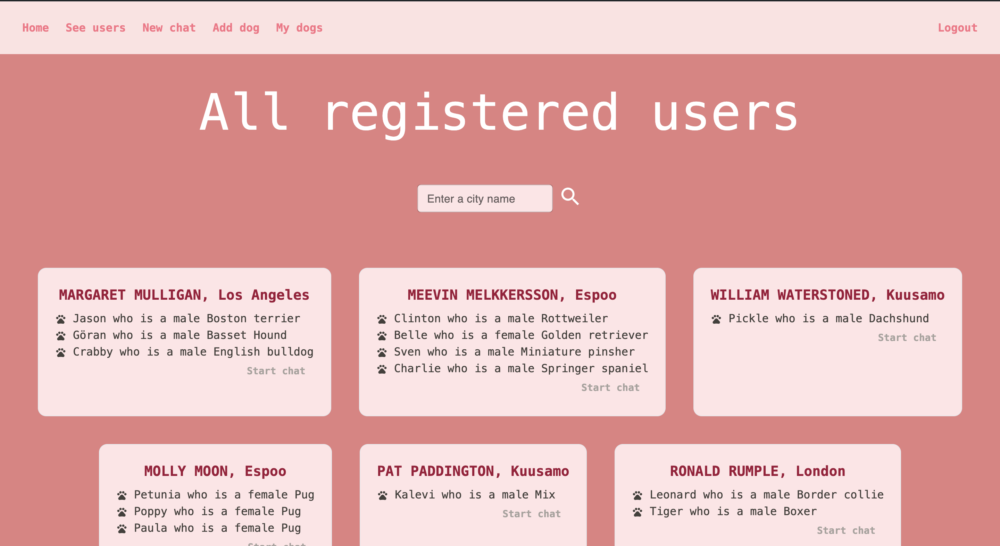
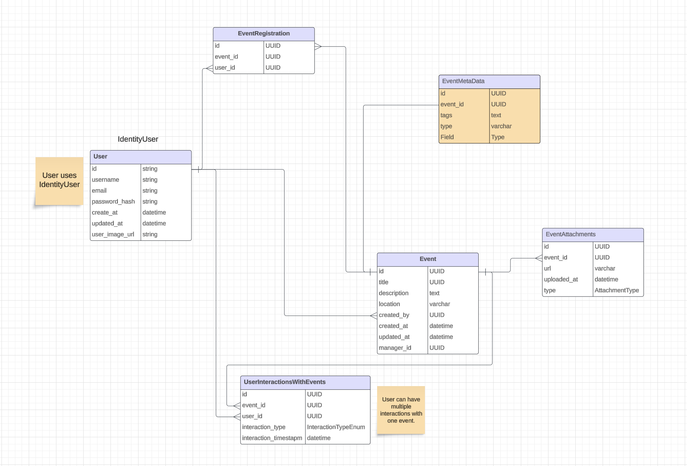
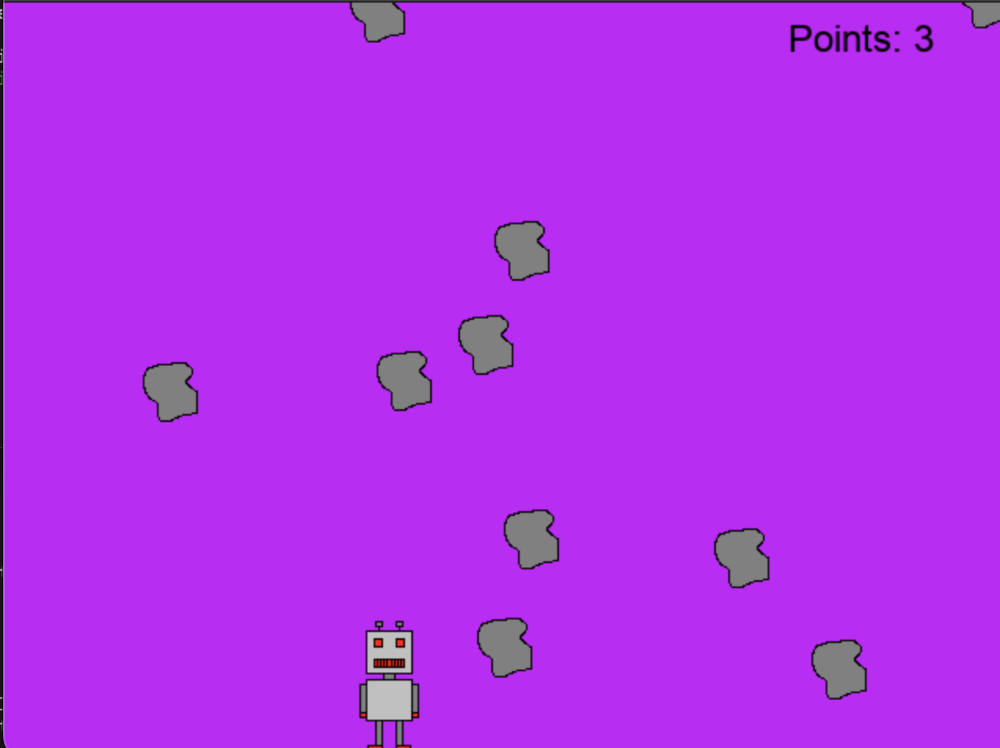
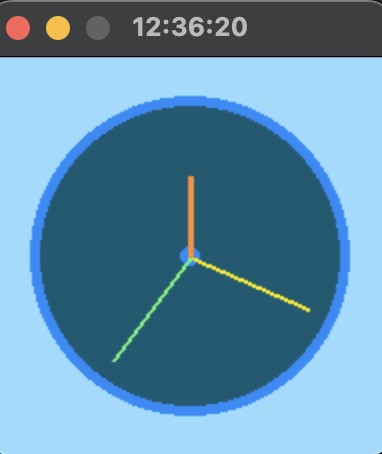

<section id="two" class="spotlights">
	<section>
		

			

				<header class="major">
					<h3>RhythmFlow</h3>
				</header>
				<i></i>
				<h5 style="text-decoration: underline;"><a href="https://rhythm-flow-frontend.onrender.com">Deployed frontend</a> || <a href="https://rhythm-flow-backend-production.onrender.com">Deployed backend</a>  <a href="https://github.com/cajsanu/rhythm-flow-frontend">Frontend code</a> || <a href="https://github.com/cajsanu/rhythm-flow-backend">Backend code</a></h5>
				
RhythmFlow is a full stack application for task management where users can sign up to start managing workspaces, projects and tickets efficiently. Users can create their own workspaces, add users to projects and workspaces and assign tickets to each other within projects. A fine grained role-based access control makes collaborating easy and allows users to pick roles for others that they want to add to their workspaces, creating a customisable collaborative environment. A dynamic Kanban drag-and-drop feature also ensures efficient ticket management within projects. 

			

		

	</section>
</section>
 
<section id="two" class="spotlights">
	<section>
		

			

				<header class="major">
					<h3>DogGo</h3>
				</header>
				<i></i>
				<h5 style="text-decoration: underline;"><a href="https://github.com/cajsanu/findFriends">Code</a></h5>
				
DogGo is a chat application for connecting dog owners who live in the same area to meet up and go for a walk together. The backend code is written using C# and ASP.NET core while the frontend is done with React and Typescrip. The messaging functionality is implememnted using SignalR. 

			

		

	</section>
</section>
 
<section id="two" class="spotlights">
	<section>
		

			

				<header class="major">
					<h3>BookShelf</h3>
				</header>
				<i></i>
				<h5 style="text-decoration: underline;"><a href="https://book-app-vdho.onrender.com/">Deployed app</a>  <a href="https://github.com/cajsanu/book-app">Code</a></h5>
				
BookShelf is a web application designed for book enthusiasts to manage their reading lists, view and interact with other users and their book collections, and share their reading experiences through comments and ratings.

			

		

	</section>
</section>
 
<section id="two" class="spotlights">
	<section>
		

			

				<header class="major">
					<h3>Azure event-management</h3>
				</header>
				<i></i>
				<h5 style="text-decoration: underline;">  <a href="https://github.com/cajsanu/azure-event-management">Code</a></h5>
				
The Event Management System is a web application built with ASP.NET Core, Entity Framework Core, and PostgreSQL. It uses ASP.NET Core Identity for user authentication and authorization, and integrates with Azure services for storage and monitoring.

			

		

	</section>
</section>
 
<section id="two" class="spotlights">
	<section>
		

			

				<header class="major">
					<h3>Robot vs. Rocks</h3>
				</header>
				<i></i>
				<h5 style="text-decoration: underline;"><a href="https://github.com/cajsanu/pygame">Code</a></h5>
				
The game is made with pygame and the aim is to collect as many falling rocks as possible. The game ends if you let any of the rocks toutch the bottom of the screen.

			

		

	</section>
</section>
 
<section id="two" class="spotlights">
	<section>
		

			

				<header class="major">
					<h3>Blogs</h3>
				</header>
				<i></i>
				<h5 style="text-decoration: underline;"><a href="https://github.com/cajsanu/blogs-postgres">Code</a></h5>
				
This is the backend for a blog application built using Node.js, Express, PostgreSQL with Sequelize for ORM, Umzug for migrations, and JSON Web Token (JWT) for authentication. The backend provides API endpoints to manage users, blogs, and user interactions like logging in/out and maintaining reading lists.

			

		

	</section>
</section>
 
<section id="two" class="spotlights">
	<section>
		

			

				<header class="major">
					<h3>Flight diary</h3>
				</header>
				<i></i>
				<h5 style="text-decoration: underline;"><a href="https://github.com/cajsanu/flightDiary-front">Code</a></h5>
				
Simple frontend project using TypeScript. Users can fetch and create diary entries for a personal fligth diary.

			

		

	</section>
</section>
 
<section id="two" class="spotlights">
	<section>
		

			

				<header class="major">
					<h3>Digital and analog clock</h3>
				</header>
				<i></i>
				<h5 style="text-decoration: underline;"><a href="https://github.com/cajsanu/clock">Code</a></h5>
			

		

	</section>
</section>
