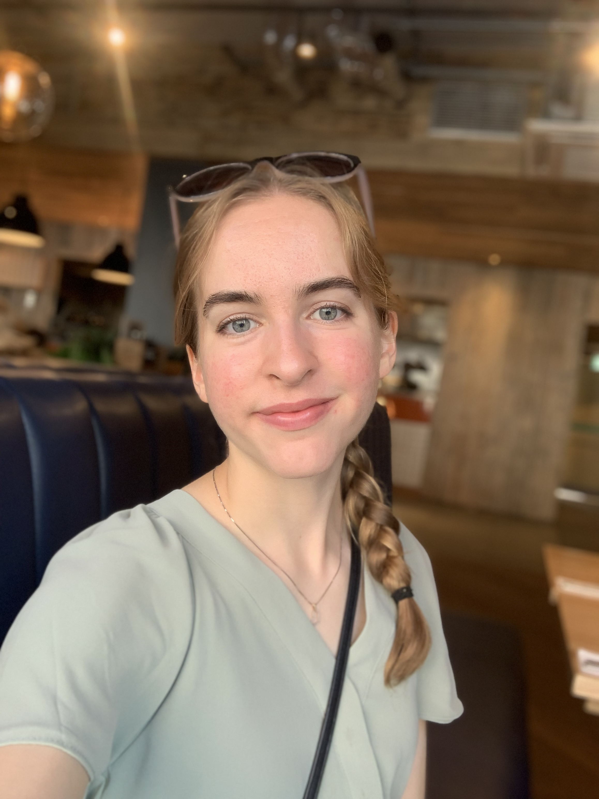
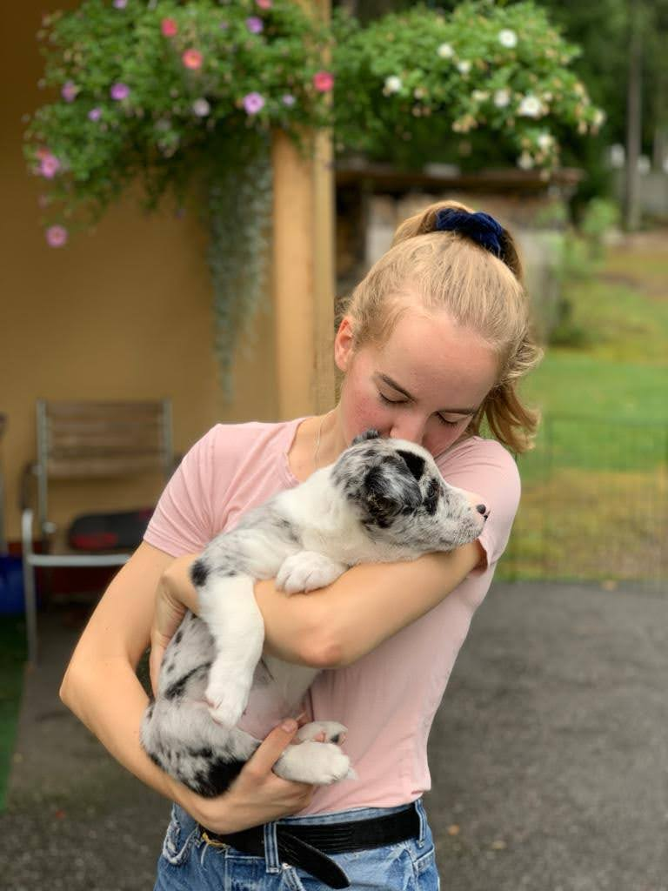

I am currently on a self-study journey to become a full-stack software engineer. What started as a harmless hobby has transformed into a growing interest and passion for software development.

As of now, I am most confident in JavaScript and Python. I have completed various projects using technologies such as React, Node.js, Express, GraphQL, PostgreSQL, MongoDB and Cypress. On the frontend, I have implemented complex state management using technologies like Redux and ReactQuery. Additionally, I have recently ventured into the realm of containers using Docker and currently I'm learning about Kubernetes.

I'm very interested in all things code and eager to learn more and get some work experience. I think I've finally found the right career path for me and I'm excited to become a professional coder.

I'm curious by nature and interested in most things, which has led to quite an array of work experience. My employers have described me as diligent, punctual and industrious and I tend to get along with most people. I'm always up for new experiences and adventures and I will work hard and put in the hours to achieve what I set my mind to.

 In my spare time I like to move and get active (gym, running, badminton, swimming, snowboarding etc.). I'm also extremely passionate about dog-agility and have been training and competing since I was 11 years old. Other that that I love reading books and travelling

